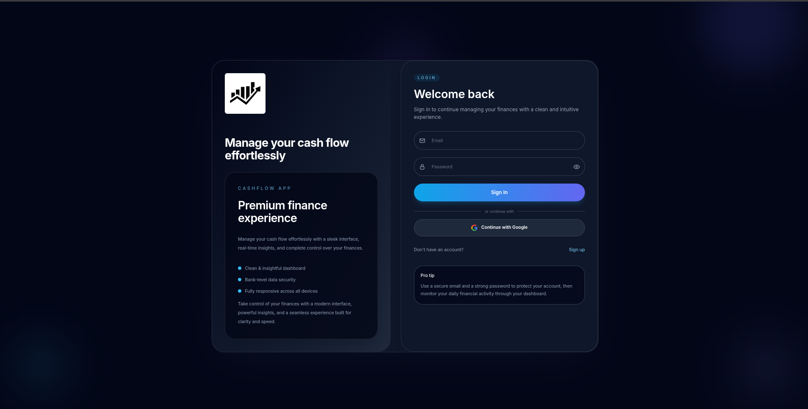
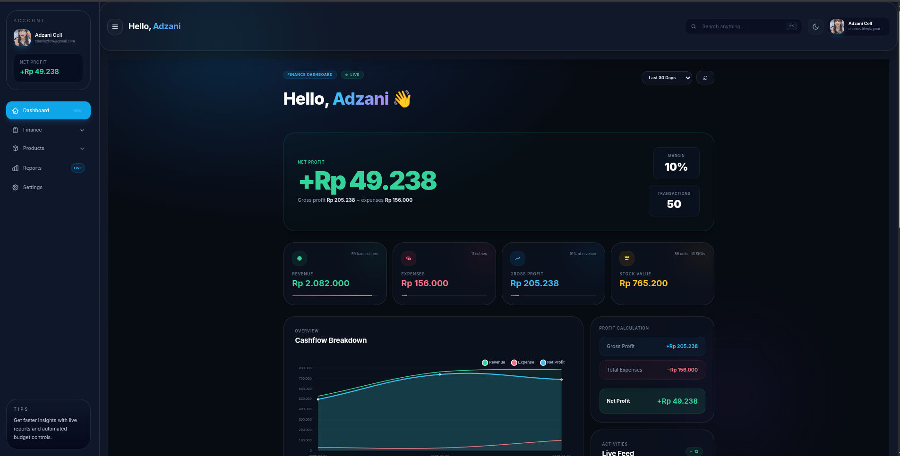
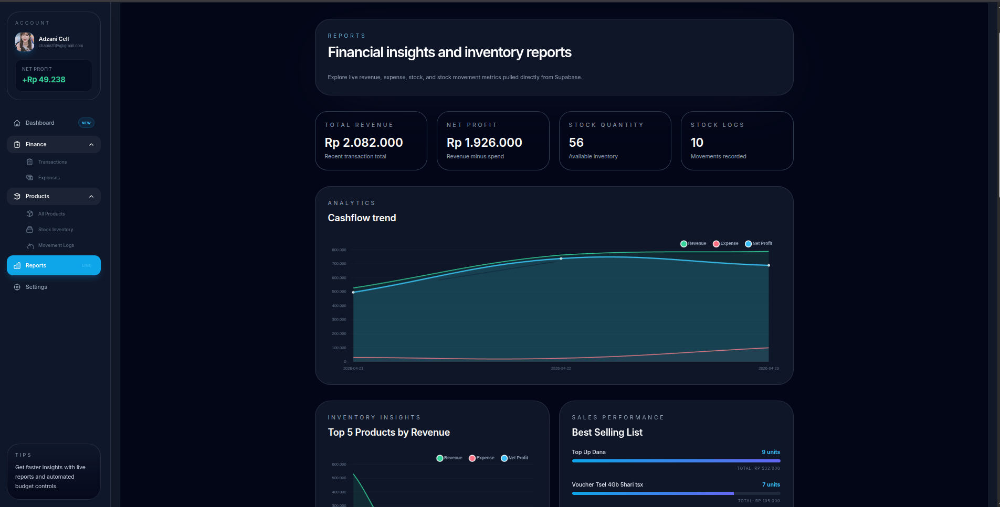

💰 Cashflow Tracker & 

📦 Inventory Management System 

A modern, full-stack financial application designed to simplify money management for small businesses and individuals. It seamlessly combines real-time financial tracking with robust inventory management.

🎨 Visual Preview

<em>Figure 1: High-level financial overview.</em>

<em>Figure 2:Repots Management.</em>

✨ Key Features
📊 Financial Intelligence Dashboard: Real-time visibility into Net Profit, Revenue, and Expenses with dynamic breakdown charts.

🛒 Comprehensive Inventory System: Manage product catalogs with cost price tracking to ensure accurate profit calculation.

📑 Audit-Ready Stock Logs: Detailed history of In/Out stock movements to prevent data discrepancies.

💸 Smart Transactions: Record sales with automatically updated inventory levels and precise profit margin reporting.

🔍 Advanced Financial Reporting: Robust filtering by date ranges (Today, Last 7 Days, Monthly, etc.) for better decision making.

🔐 Enterprise-Grade Security: Seamless Google Auth integration and Row Level Security (RLS) via Supabase.

📱 Modern, Responsive Design: A beautiful dark-themed interface built with Tailwind CSS, optimized for all devices.

🛠️ Tech Stack & Architecture
This project uses a modern, high-performance tech stack:

Frontend: React.js & TypeScript for a type-safe UI.

Styling: Tailwind CSS with advanced visual effects.

State: Zustand for clean, performant state management.

Backend: Supabase (PostgreSQL + Auth + RLS) for a scalable database solution.

Routing: React Router v6 for seamless navigation.

📂 Project Structure

Bash
/src
├── /components
│   ├── /layout      # Topbar, Sidebar, Footer
│   └── /pages       # Main view logic (Dashboard, Stock, Transaction)
├── /hooks           # Custom hooks for business logic
├── /lib             # API configuration (Supabase)
└── /types           # TypeScript interfaces

🚀 Getting Started
To run this project locally, follow these steps:

📋 Prerequisites
Node.js (v18 or higher)

A free Supabase account

🔧 Installation
Clone the repository:

Bash
git clone https://github.com/Efwan016/cashflow-tracker.git
cd cashflow-tracker
Install dependencies:

Bash
npm install
Setup Environment Variables:
Create a .env file in the root directory and add your credentials:

Cuplikan kode
VITE_SUPABASE_URL=your_supabase_url
VITE_SUPABASE_ANON_KEY=your_supabase_anon_key
Run the development server:

Bash
npm run dev
📄 License
This project is licensed under the MIT License. See LICENSE for details.

🤝 Contact
Developed by Efwan Rizaldi

